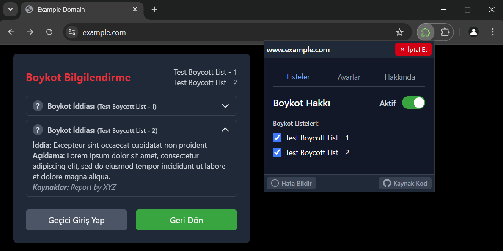

# Boykot Hakkı (Tarayıcı Eklentisi)




Boykot Hakkı eklentisi, kullanıcının etkinleştirdiği boykot listelerine göre bilgilendirme sunar. Eklenti, tamamen
kullanıcı tarayıcısında çalışır; herhangi bir kişisel veriyi toplamaz, işlemez veya üçüncü taraflarla paylaşmaz. Kaynak
kodu, Özgür Yazılım lisansı ile açık olarak yayımlanmıştır. Hatalı bilgiler kullanıcı bildirimi ile düzeltilebilir
(bkz. [İletişim](#iletişim)).

## Özellikler

- Tam **Türkçe desteği** bulunmaktadır.
- **Hazır boykot listeleri** ile gelmektedir.
- Eklenti ve boykot listeleri **varsayılan olarak kapalı** gelmektedir.
    - _Eklentiyi kuran kullanıcılar kendi tercihlerine göre aktif etmelidir._
- Aktif edilen boykot listelerinde bulunan bir websiteye girildiğinde **boykot bilgilendirmesi** yapılmaktadır.
- Boykotlu **websiteden çıkış** veya **websiteye giriş** yapmak için kullanıcıya seçenek sunulmakta ve kullanıcı
  inisiyatifine
  bırakılmaktadır.
    - _Boykotlu websiteye giriş yapıldığında, eklenti ayarlar menüsünde seçilen süre kadar tekrar uyarı göstermez._
- Boykot listelerindeki boykot etmek istemediğiniz websiteler için eklenti menüsünde **boykotu iptal et** ve **boykotu
  aktif et** seçeneği sunulmaktadır.
- 4 saatte bir boykot listelerini GitHub repo içerisindeki `assets/boycott_lists/...` üzerinden günceller.
    - _Boykot listeleri güncellendikçe mağazalara çok sık yeni eklenti sürümü çıkarmamak için bu şekilde yapılmıştır.
      Güncel listeyi çekemezse, eklenti içerisinde gelen listeyi kullanır._

## Tarayıcı Uyumluluğu

Tüm tarayıcılarla uyumlu olması için [WXT](https://wxt.dev/) framework'ü ile geliştirildi.

- **Chrome** (_test edilen version: > v134.x_)
- **Firefox** (_test edilen version: > v136.x_)
- **Safari** (_test edilmedi_)
- **Edge** (_test edilmedi_)
- **Firefox Mobil** (_test edilmedi_)
- **Diğer Chromium tabanlı tarayıcılar** (_test edilmedi_)

> Eklenti `pre-alpha` sürecinde geliştirilmeye devam etmektedir.  
> Resmi olarak daha hiçbir tarayıcı eklenti marketinde yayınlanmamıştır!

## Kurulum

### 1. Gereksinimler

- [Node.js](https://nodejs.org/en/download) (v20.x veya üzeri)
- [pnpm](https://pnpm.io/installation) (v10.x veya üzeri)

### 2. Depoyu Klonlayın ve Bağımlılıkları Yükleyin

```bash
git clone https://github.com/farukeryilmaz/boykot-hakki-eklentisi.git
cd boykot-hakki-eklentisi
pnpm install
```

### 3. Geliştirme Ortamını Başlatın

```bash
pnpm dev
```

Bu komut, WXT'nin geliştirme modunu başlatır ve eklentinin kurulu olduğu izole bir **Chrome** oturumu başlatır. Canlı
yenileme (hot reload) desteğiyle eklentiyi geliştirebilir, test edebilirsiniz.

> Firefox'ta çalıştırmak için: `pnpm dev:firefox`

## Katkıda Bulunmak

_Katkıda bulunmak isteyenler için yönergeler, davranış ve etik kuralları (code of conduct) dokümanı yazılıyor, beklemede
kalın!_

### Geliştirici Notları

Boykot Listeleri: `assets/boycott_lists/` içindeki JSON dosyalarını düzenleyerek test etmek isterseniz,
[background.ts](entrypoints/background.ts) dosyasındaki fetch özelliğini kapatınız yoksa sizin güncellediğiniz lokal
liste yerine GitHub'dan çektiği listeyi kullanır.

## Yasal Bilgilendirme

Tüketiciler, 6502 sayılı Tüketicinin Korunması Hakkında Kanun ve Anayasa’nın 26. maddesi uyarınca, satın alıp almama
hakkına ve düşünce açıklama ve yayma özgürlüğüne sahiptir. Bu kapsamda, bireysel veya toplu tüketici boykotu hukuken
mümkündür. Eklenti, bu hak doğrultusunda kullanıcıya bilgi verir; herhangi bir kuruluş veya ürün hakkında yönlendirme
veya zorlama içermez.

Eklenti yalnızca tüketici boykotunu destekler; şirketler arası ticari boykotu içermez. Kamu kurumlarına yönelik
listeler, yalnızca kullanıcı talebiyle görünür ve içeriğinde şiddet, tehdit veya hakaret bulundurmaz; 5237 sayılı Türk
Ceza Kanunu’nun 125 ve 301. maddeleri kapsamında suç teşkil eden içeriklere izin verilmez.

Bu eklenti, ifade özgürlüğü ve tüketicinin bilgiye dayalı tercih hakkını destekleyen yasal bir araçtır. Kullanıcı
dilerse kendi aktif ettiği tüm boykot listelerini ve eklentiyi devre dışı bırakabilir.

## İletişim

Sorularınız, hata bildirimleriniz ya da önerileriniz için GitHub
üzerinden [issue](https://github.com/farukeryilmaz/boykot-hakki-eklentisi/issues) açabilir,
`faruk [at] farukeryilmaz [dot] com` ya da sosyal medya (
Bluesky: [@farukeryilmaz.com](https://bsky.app/profile/farukeryilmaz.com),
X: [@farukerylmz](https://twitter.com/farukerylmz)) üzerinden iletişime geçebilirsiniz.

## Lisans

Bu proje [GNU Genel Kamu Lisansı v3.0 (GPL-3)](LICENSE) ile lisanslanmıştır—kodları özgürce kullanabilir, paylaşabilir
ve geliştirebilirsiniz. Ticari kullanım, dağıtım ve değiştirme hakkına sahipsiniz ancak türetilmiş çalışmalar da aynı
lisans altında kullanıcılarınıza dağıtılmalıdır.